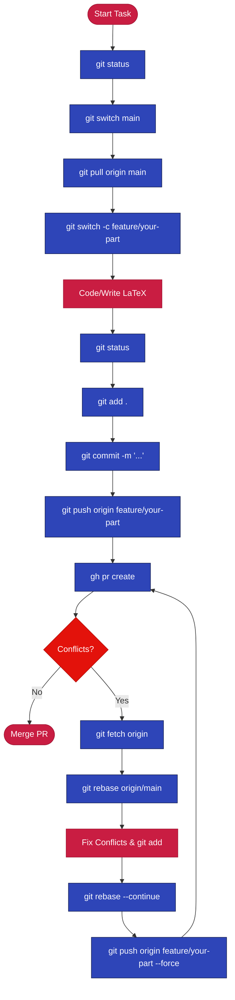

# Hybrid Econometric and Machine Learning Modeling of Philippine Stock Returns

**Course:** FINLYTS
**Professor:** Bobby Baylon Jr.
**Status:** In Progress — Banking Sector (BPI & BDO)

---

## Project Overview

This project develops and compares econometric and machine learning models to
predict multi-horizon stock returns of Bank of the Philippine Islands (BPI)
and BDO Unibank (BDO). The analysis spans three prediction horizons and five
model families, evaluated on both statistical and financial performance metrics.

---

## Role Assignments

| Part | Person Assigned |
| :--- | :--- |
| Introduction | Jehan |
| Literature Review | Aaron and Carlos |
| Data and Feature Engineering | Aaron |
| Methodology | Aaron |
| Results | Carlos |
| Discussion | Aaron and Carlos |
| Conclusion and Recommendations | Keira |
| References | Aaron |
| Appendix | Aaron |
| 01 Data Pull Script | Jehan |
| 02 Feature Engineering Script | Aaron |
| 03 OLS Baseline Script | Carlos |
| 04 RF and XGBoost Script | Aaron |
| 05 SVM and ANN Script | Aaron |
| 06 Evaluation Script | Aaron and Keira |

---

## Paper Outline

The final deliverable is a full academic paper structured as follows.

**Section 1: Introduction**
Justification for the selected stock pair (BPI & BDO), rationale for the model
choices, and the specific research question being answered within the context of
Philippine capital markets.

**Section 2: Literature Review**
Survey of prior work on ML-based stock return prediction, the Efficient Market
Hypothesis debate in frontier markets, and PSE-specific empirical studies.

**Section 3: Data and Feature Engineering**
Data sources and sample period (2019 to present). Construction of all three
target variables with explicit formulas. All mandatory technical indicators
(MA, EMA, RSI, MACD, rolling volatility), cross-asset features (PSEi, competitor
returns, macro variable), feature transformations (interaction term, squared
volatility), and the COVID/Volatility regime dummy. Descriptive statistics table.

**Section 4: Methodology**
Time-series split rationale. OLS benchmark specification. Architecture and
training procedure for each ML model (Random Forest, SVM, XGBoost, ANN).
Hyperparameter tuning procedure. Definition of all evaluation metrics (RMSE,
MAE, R-squared, Directional Accuracy).

**Section 5: Results**
Main results tables: RMSE, MAE, R-squared, and Directional Accuracy across
all five models and all three prediction horizons, forming a 5 x 3 matrix per
metric. Feature importance plots for Random Forest and XGBoost. OLS coefficient
table. Predicted vs. actual plot for the best-performing model.

**Section 6: Discussion**
Economic interpretation of all findings. Model comparison with financial
reasoning. Horizon analysis (why short-horizon may differ from long-horizon
predictability). Feature importance interpretation in terms of momentum, trend,
and macro channels. Structural break effects on coefficients. Assessment
of whether results support or challenge weak-form EMH for the PSE.
Overfitting analysis comparing training and testing performance.

**Section 7: Conclusion and Recommendations**
Summary of findings, practical implications for analysts, limitations of the
study, and directions for future research.

**Section 8: References**
All citations in APA 7 format with DOI or URL.

**Section 9: Appendix**
Full reproducible R code. All scripts are numbered 01 through 06 and run
sequentially from a clean R environment.

---

## Models

| Model | Type | Package |
|---|---|---|
| OLS | Benchmark econometric | `stats::lm` |
| Random Forest | Ensemble ML | `ranger` via `tidymodels` |
| Support Vector Machine | Kernel ML | `kernlab` via `tidymodels` |
| XGBoost | Gradient boosting | `xgboost` via `tidymodels` |
| ANN | Neural network | `nnet` via `tidymodels` |

---

## Prediction Targets

| Horizon | Formula |
|---|---|
| 1-day | $r_{t+1} = \log(P_{t+1} / P_t)$ |
| 3-day cumulative | $r_{t:t+3} = \sum_{i=1}^{3} r_{t+i}$ |
| 5-day cumulative | $r_{t:t+5} = \sum_{i=1}^{5} r_{t+i}$ |

Separate models are estimated for each target. No look-ahead bias.

---

## Repository Structure

```
├── data/
│   ├── raw/              # Pulled directly from Yahoo Finance via tidyquant
│   └── processed/        # Feature-engineered analysis-ready dataset
├── R/
│   ├── 01_data_pull.Rmd
│   ├── 02_feature_engineering.Rmd
│   ├── 03_ols_baseline.Rmd
│   ├── 04_models_rf_xgboost.Rmd
│   ├── 05_models_svm_ann.Rmd
│   └── 06_evaluation.Rmd
├── paper/
│   ├── main.tex          # Final LaTeX paper
│   ├── references.bib    # APA 7 BibTeX entries
│   ├── tables/           # Auto-generated LaTeX tables from R
│   └── figures/          # Auto-generated plots from R
├── docs/
│   └── MACHINE_LEARNING_CASE_STUDY_INSTRUCTIONS_AND_RUBRIC.pdf
├── output/
│   ├── models/           # Saved model objects (.rds)
│   └── predictions/      # Test set predictions (.csv)
├── .gitignore
└── README.md
```

---

## Critical Rules

1. Time-series split only. `train_test_split(shuffle=TRUE)` equivalent in R is forbidden.
2. No look-ahead bias. All features use `dplyr::lag()`. Targets use `dplyr::lead()` and are assigned as separate columns.
3. SVM requires feature standardization. Scaler fitted on training set only.
4. Hyperparameter tuning uses `rsample::rolling_origin()` inside `tune::tune_grid()`, not standard k-fold CV.
5. All citations APA 7 with DOI or URL.

---

## Workflow & Tooling

### 1. GitHub CLI Guide (`gh`)
Use the RStudio Terminal to manage the repository without leaving the IDE.

| Command | Action |
| :--- | :--- |
| `gh auth login` | Initial setup/authentication |
| `gh pr create` | Create a Pull Request for your branch |
| `gh pr list` | View active PRs in the group |
| `gh pr checkout <num>` | Pull a teammate's PR locally to test |
| `gh pr merge` | Merge your PR after review |
| `gh browse` | Open the repository in your browser |
| `gh run list` | Check status of GitHub Actions (if any) |

### 2. Git Step-by-Step Workflow

Follow this sequence to ensure your changes are safely integrated.

#### Workflow Visualization


**A. Before you start working**
1. Open RStudio Terminal.
2. `git status` — Check which branch you are on.
3. `git switch main` — Switch to the main branch.
4. `git pull origin main` — Get the latest updates from the team.
5. `git switch -c feature/your-part` — Create a new branch for your specific task.

**B. When you finish a part/task**
1. `git status` — Verify which files you modified.
2. `git add .` — Stage your changes (ensure no large data files are staged).
3. `git commit -m "Description of what you did"` — Save your progress locally.
4. `git push origin feature/your-part` — Upload your branch to GitHub.
5. `gh pr create` — Open a Pull Request for the team to review.

**C. Handling Conflicts (The Rebase Method)**
If someone else modified the same file and merged it before you:
1. `git fetch origin` — Update your local knowledge of the remote repo.
2. `git rebase origin/main` — Re-apply your changes on top of the latest `main`.
3. Fix any conflicts in the files (look for `<<<<<<< HEAD`).
4. `git add <fixed-file>`
5. `git rebase --continue`
6. `git push origin feature/your-part --force` — Update your PR with the clean history.

**Best Practice:** Always run `git status` before `git add` and before `git push` to avoid accidentally committing temporary files or working on the wrong branch.

### 3. LaTeX Workflow

The final paper is compiled from `paper/main.tex`.

| Command | Action |
| :--- | :--- |
| `pdflatex main.tex` | Compile the document (run twice for refs) |
| `bibtex main` | Process references in `references.bib` |
| `latexmk -pdf main.tex` | **Recommended:** One command to handle all steps |
| `latexmk -c` | Clean up auxiliary files (`.aux`, `.log`, etc.) |

**Step-by-Step Guide:**
1. **Export:** Run your R scripts to save tables (`.tex`) and figures (`.png`/`.pdf`) into the `paper/tables/` and `paper/figures/` folders.
2. **Update Refs:** Add any new citations to `paper/references.bib` in APA format.
3. **Edit:** Update your assigned section in `paper/main.tex`. Use `\input{tables/your_table.tex}` for tables.
4. **Compile:** Run `latexmk -pdf main.tex` in the terminal inside the `paper/` directory.
5. **Review:** Open the generated `main.pdf` to check formatting and citations.

**Best Practice:**
- **Modular Tables:** Do not manually type tables. Export them from R.
- **Figures:** Place all plots in `paper/figures/`.
- **Version Control:** Only commit `.tex`, `.bib`, and image files. Do **not** commit `.pdf`, `.aux`, or `.log` files.

---

## Data Sources

All data pulled programmatically via `tidyquant::tq_get()` from Yahoo Finance.

| Series | Yahoo Finance Ticker |
|---|---|
| Target stock | BPI.PS |
| Competitor stock | BDO.PS |
| PSEi Index | ^PSEi |
| USD/PHP Exchange Rate | PHP=X |

### Project Configuration
- **Industry:** Banking
- **Macro Variables:** USD/PHP Exchange Rate, (Second Variable TBA)
- **Regime Definition:** High Volatility (1 when 20-day vol > 2x historical average)

---

## Instructions and Rubric

See `docs/MACHINE_LEARNING_CASE_STUDY_INSTRUCTIONS_AND_RUBRIC.pdf`

---

## Bonus Targets (optional, +5 pts)

- Rolling or expanding window validation via `rsample::rolling_origin()`
- Simple trading strategy evaluation based on Directional Accuracy
- Hybrid econometric plus ML residual model
- SHAP interpretability via `SHAPforxgboost`
